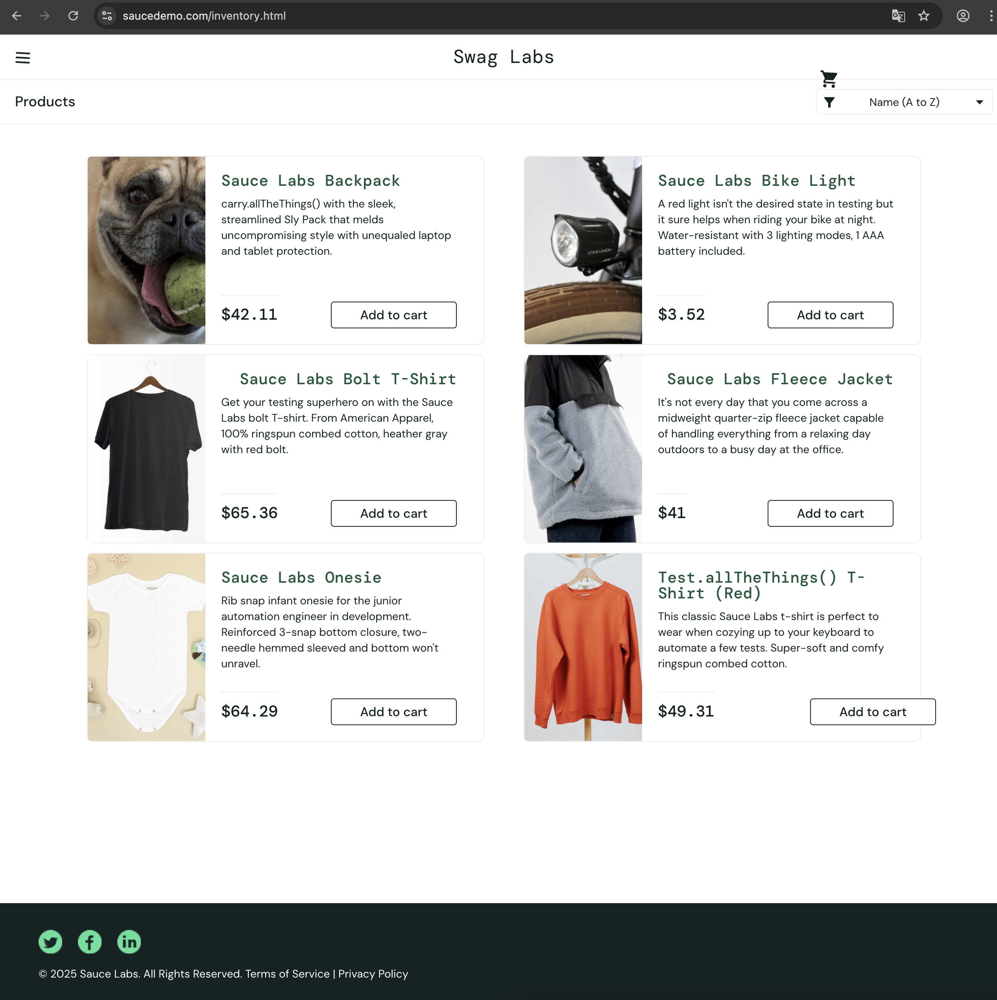
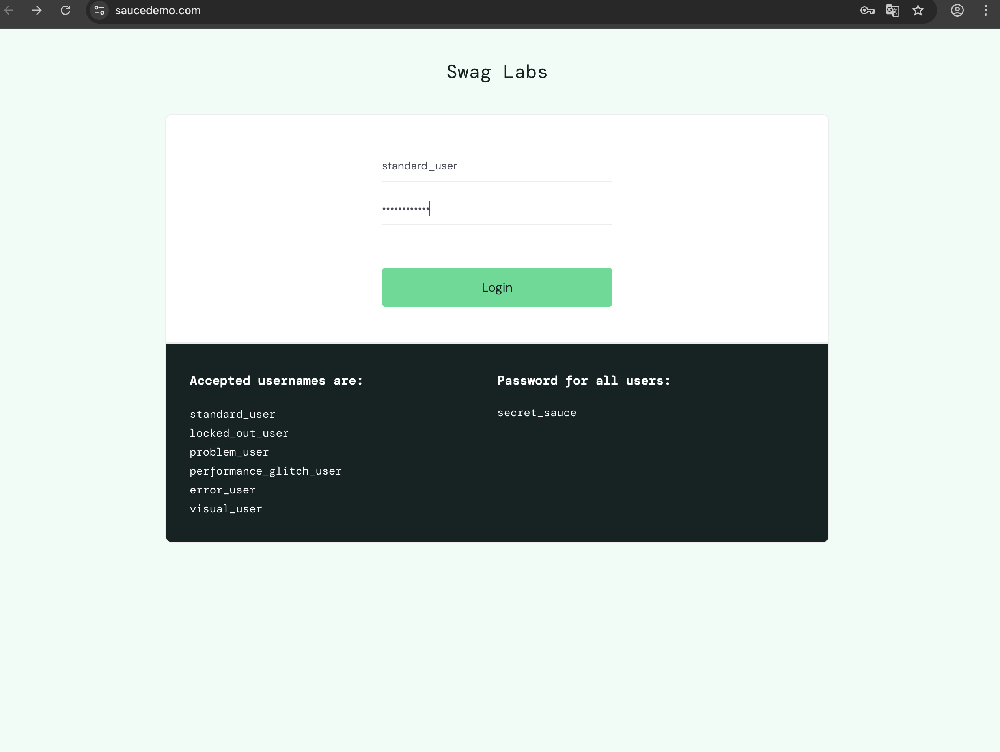
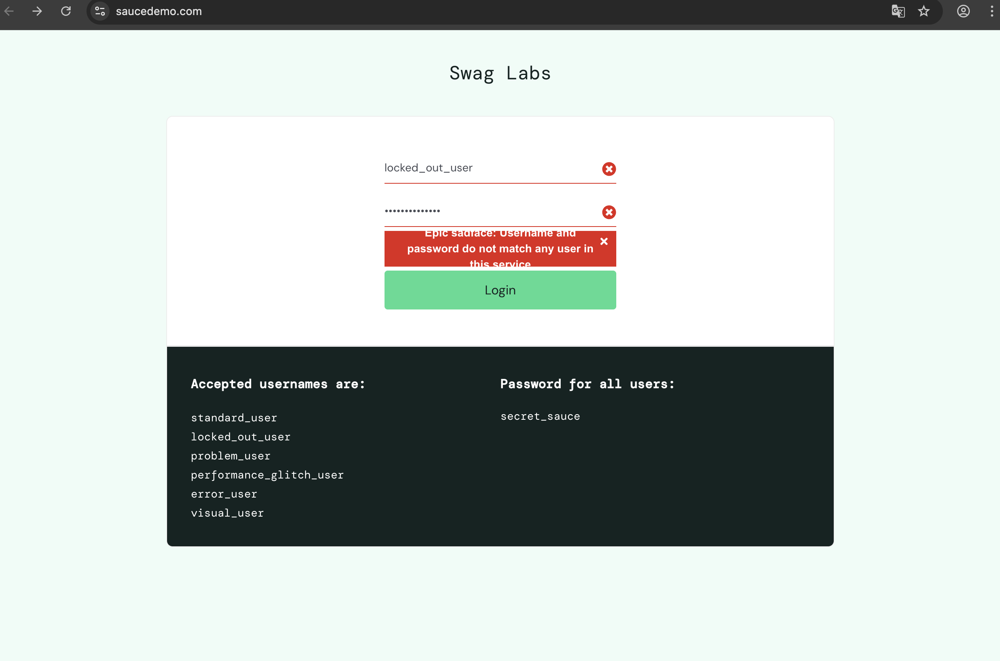

# Задание 1. Составить тест-кейс
---
## Позитивный сценарий авторизации
---
### Тест-кейс 1: Успешная авторизация с валидными данными

**Предусловия:**

- Пользователь находится на странице https://www.saucedemo.com/

- Браузер открыт и работает стабильно

**Шаги:**

1. В поле "Username" ввести: visual_user

2. В поле "Password" ввести: secret_sauce

3. Нажать кнопку "Login"

**Ожидаемый результат:**

Происходит успешная авторизация

### Тест-кейс 2: Успешная авторизация с валидными данными
---
**Предусловия:**

- Пользователь находится на странице https://www.saucedemo.com/

- Браузер открыт и работает стабильно

**Шаги:**

1. В поле "Username" ввести: standard_user

2. В поле "Password" ввести: secret_sauce

3. Нажать кнопку "Login"

**Ожидаемый результат:**

Происходит успешная авторизация

## Негативные сценарии
---

### Тест-кейс 3: Проверка работы проблемного пользователя
---

**Предусловия:**

- Пользователь находится на странице https://www.saucedemo.com/

- Браузер открыт и работает стабильно

**Шаги:**

1. В поле "Username" ввести: problem_user

2. В поле "Password" ввести: secret_sauce

3. Нажать кнопку "Login"

**Ожидаемый результат:**

Появляется сообщение об ошибке: "Epic sadface: Username and password do not match any user in this service."

Авторизация не происходит

### Тест-кейс 4: Проверка работы проблемного пользователя
---

**Предусловия:**

- Пользователь находится на странице https://www.saucedemo.com/

- Браузер открыт и работает стабильно

**Шаги:**

1. В поле "Username" ввести: locked_out_user

2. В поле "Password" ввести: secret_sauce

3. Нажать кнопку "Login"

**Ожидаемый результат:**

Появляется сообщение об ошибке: "Epic sadface: Username and password do not match any user in this service"

Авторизация не происходит

