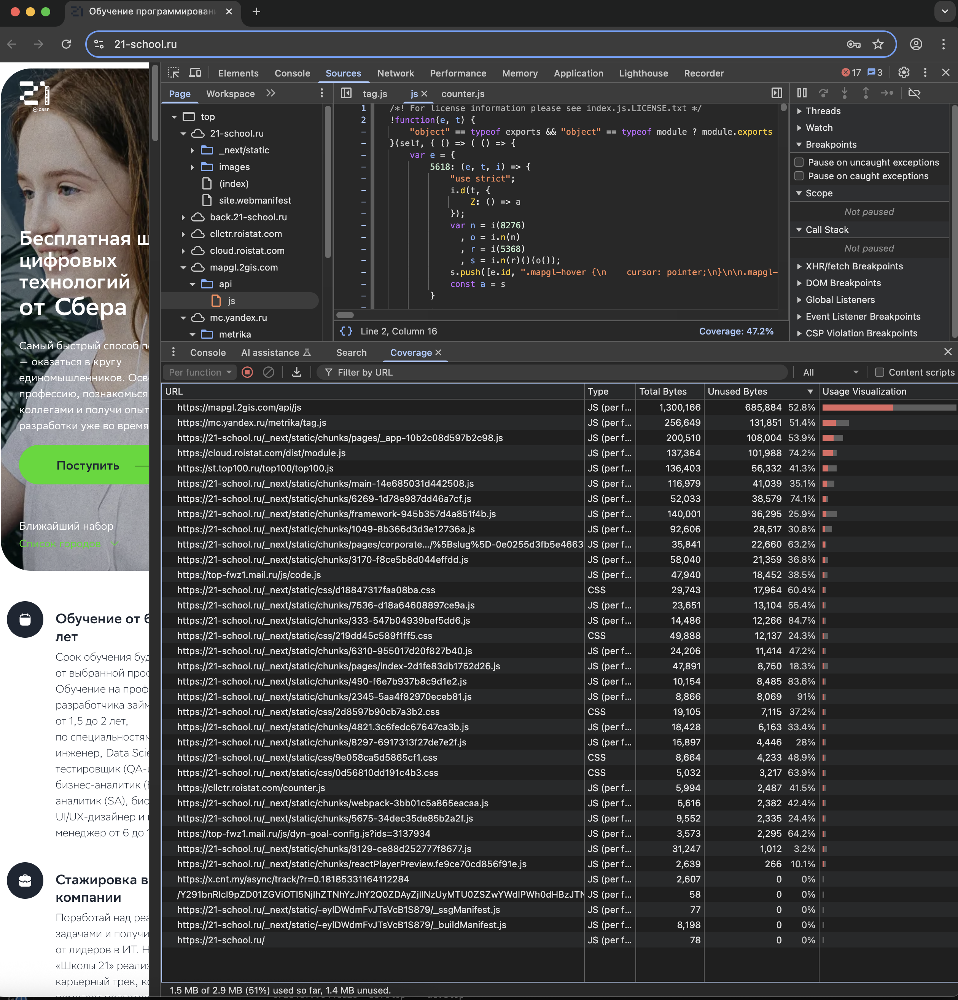
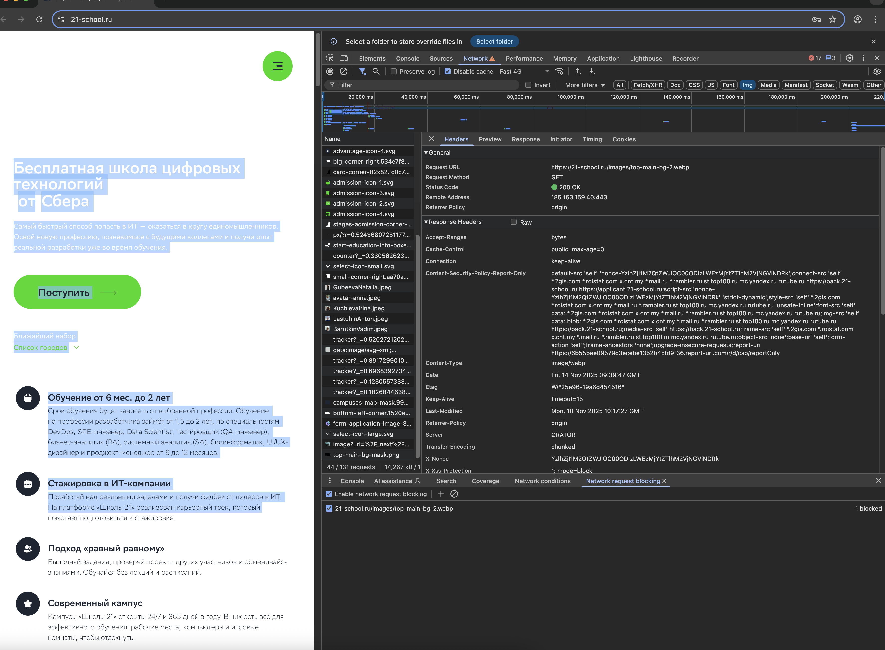

# Таблица вкладок DevTools

| Вкладка | Назначение | Ключевые возможности | Пример использования |
| :--- | :--- | :--- | :--- |
| **Elements** | Просмотр и редактирование структуры HTML и CSS страницы. | <ul><li>Просмотр DOM-дерева.</li><li>Инспектирование элементов.</li><li>Редактирование стилей и контента в реальном времени.</li></ul> | Заголовок стал белым на белом фоне. Во вкладке Elements можно найти этот элемент и изменить его цвет, чтобы исправить проблему. |
| **Console** | Просмотр ошибок, логов и выполнение JavaScript-команд. | <ul><li>Просмотр ошибок и предупреждений.</li><li>Выполнение команд JS.</li><li>Взаимодействие с DOM.</li></ul> | Цена товара не отображается. Console покажет ошибку, например, о попытке обратиться к несуществующему элементу. |
| **Sources** | Просмотр и отладка исходных файлов проекта (HTML, CSS, JS). | <ul><li>Просмотр структуры файлов сайта.</li><li>Отладка JavaScript.</li><li>Установка точек останова (breakpoints).</li></ul> | Кнопка "Добавить в корзину" не работает. Во вкладке Sources можно найти и проверить соответствующий JavaScript-файл. |
| **Network** | Мониторинг сетевой активности страницы. | <ul><li>Просмотр всех HTTP-запросов.</li><li>Анализ времени загрузки.</li><li>Проверка статусов ответов (200, 404, 500).</li><li>Просмотр заголовков и тела запросов (Payload).</li></ul> | Форма не отправляется. Во вкладке Network видно, что запрос возвращает статус 500, что указывает на серверную ошибку. |
| **Performance** | Анализ производительности загрузки и выполнения страницы. | <ul><li>Запись и анализ производительности.</li><li>Выявление "бутылочных горлышек".</li><li>Мониторинг загрузки ЦП и памяти.</li></ul> | Страница тормозит при прокрутке. Вкладка Performance покажет, что анимации перегружают процессор. |
| **Memory** | Анализ использования памяти и поиск утечек. | <ul><li>Создание снимков памяти (Heap Snapshot).</li><li>Отслеживание использования памяти во времени.</li><li>Поиск утечек памяти.</li></ul> | После многократных действий страница начинает lag-ить. Memory поможет найти объекты, которые не удаляются из памяти. |
| **Application** | Просмотр и управление данными, которые хранит сайт в браузере (локальное хранилище). | <ul><li>Просмотр и редактирование Local Storage, Session Storage, Cookies.</li><li>Управление базами данных IndexedDB и Web SQL.</li><li>Просмотр кеша приложения (Cache Storage) для Service Workers.</li><li>Управление ресурсами (шрифты, изображения и т.д.).</li></ul> | Данные пользователя (например, токен авторизации) не сохраняются между сессиями. Во вкладке Application можно проверить, правильно ли они записываются в Local Storage. |
| **Privacy and Security** | Проверка безопасности соединения и SSL-сертификата. | <ul><li>Проверка SSL-сертификата.</li><li>Выявление смешанного контента (HTTP/HTTPS).</li><li>Общая оценка безопасности.</li></ul> | Браузер показывает предупреждение "Небезопасно". Вкладка Security укажет, что некоторые ресурсы (картинки) загружаются по HTTP. |
| **Lighthouse** | Комплексный аудит качества веб-страницы. | <ul><li>Проверка производительности.</li><li>Проверка доступности (Accessibility).</li><li>Проверка SEO.</li><li>Проверка лучших практик (Best Practices).</li><li>Проверка PWA.</li></ul> | Сайт медленно грузится на телефонах. Lighthouse укажет на необходимость оптимизировать изображения и настроить кеширование. |
| **Recorder** | Запись и воспроизведение пользовательских сценариев для тестирования и отладки. | <ul><li>Запись действий пользователя (клики, ввод, навигация).</li><li>Воспроизведение записанных сценариев.</li><li>Экспорт сценария в виде кода для тестов (например, Puppeteer).</li><li>Измерение производительности во время воспроизведения.</li></ul> | Нужно протестировать сложный сценарий покупки товара. Recorder запишет все шаги, а затем их можно будет воспроизвести для проверки на наличие ошибок. |

# название любого раздела

# все неиспользуемые CSS и JS в верстке.

# замеры скорости загрузки страницы

| Скорость сети | DCL(DomContentLoaded) | Load(Полная загрузка) |
|:-------:|:-------:|:-------:|
| Fast 4G | 2.19s | 4.31s |
| Slow 4G | 10.37s |17.08s |
| 300kbit/s | 7.93s | 17.43s |

# Заблокируй любую картинку на сайте

