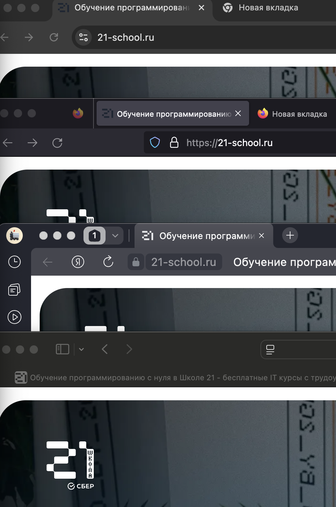

# Отчет по тестированию кроссбраузерной совместимости
## Названия: Тестирования сайти школы 21 в разных браузеров
## Шаги: открывать сайт в браузерах:
1. safari
2. fixfox
3. yandex
искать различия сайта 
## Проверяемый элемент
Фавикон
Шапка сайта с навигацией
Главный заголовок
Кнопки СТА
Карточки услуг
Форма обратной связи
Кнопка поступить
## Инструменты для написания
Sfari
Yandex
Fixfox
DevTools

| Проверяемый элемент | Конкретное отличие | Предполагаемая техническая причина отличия | Номер скриншотов |
|---------------------|-------------------|-------------------------------------------|------------------|
| Фавикон | разная иконка в Safari и Fixfox черная в Yandex белая, в Crome зеленая | Использовать одинаковый дизайн для всех размеров и форматов, Тестировать на разных платформах |  |
| Шапка сайта с навигацией | не отличаются | Предполагаемая техническая причина нету | нету |
| Главный заголовок | В Firefox межбуквенное расстояние отличается от Chrome и Safari | Разная интерпретация letter-spacing в Gecko vs WebKit/Blink |  |
| Кнопки CTA | не отличаются  | Предполагаемая техническая причина нету | нету |
| Карточки услуг | не отличаются  | Предполагаемая техническая причина нету | нету |
| Форма обратной связи | не отличаются  | Предполагаемая техническая причина нету | нету |
| Кнопка поступить | В Firefox спускается по экрану очень зависающи | "Тяжелый" JavaScript, Конфликт расширений браузера, Проблемы с композицией слоев и рендерингом | это никак не заскринить |

кроссбраузерное тестирование

Настроить автоматические тесты в BrowserStack

Добавить визуальное регрессионное тестирование

Проверять на реальных устройствах с разными ОС