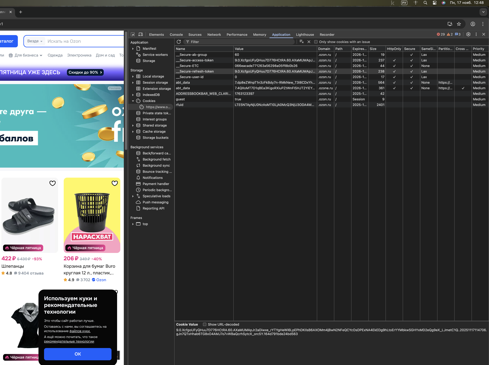

# Анализ Cookies на сайте Ozon.ru
## Адрес сайта: https://www.ozon.ru/

## Выбранные Cookies и их анализ:
| Имя | Тип | Предполагаемое назначение | Secure | HttpOnly| SameSite(lax/None)|
|:----:|:-----:|:---------:|:-------:|:------:|:------:|
| Secure-access-token | Persistent Cookie | Токен доступа для аутентификации пользователя. Используется для подтверждения прав доступа к защищенным ресурсам и API после успешного входа в систему.| ✓ | ✓ | Lax |
| Secure-refresh-token | Persistent Cookie |Токен обновления, который используется для получения нового access-token'а когда старый истекает, без необходимости повторного ввода логина и пароля. | ✓ | ✓ | Lax |
|  guest | Session Cookie | Определяет статус пользователя как гостя (неавторизованного). Используется для предоставления базового функционала без регистрации, например, добавления товаров в корзину.| не указан | не указан | не указан | 
| xcid | Session Cookie | Идентификатор сессии или отслеживания пользователя. Может использоваться для аналитики, отслеживания пользовательского пути по сайту и связывания действий в рамках одной сессии. | не указан | не указан | не указан |
| ADDRESSBOOKEAR_WEB| Persistent Cookie  | Вероятно связан с функционалом адресной книги пользователя. Может хранить информацию о сохраненных адресах доставки или настройках локации. | не указан | не указан |не указан |

Несмотря на хорошую защиту основных аутентификационных токенов, наличие нескольких критически важных cookies без базовых мер безопасности создает значительные риски для пользователей.

Ozon не использует традиционный cookie для хранения данных корзины. 

Результат эксперимента: Удаление xcid
Подтверждено: Cookie xcid не критичен для основного функционала

Что произошло:
Сайт продолжил работать нормально

Пользователь остался авторизованным

Корзина сохранилась

Интерфейс не изменился

При обновление страницы 

Автоматически создался новый xcid с другим значением
 
 