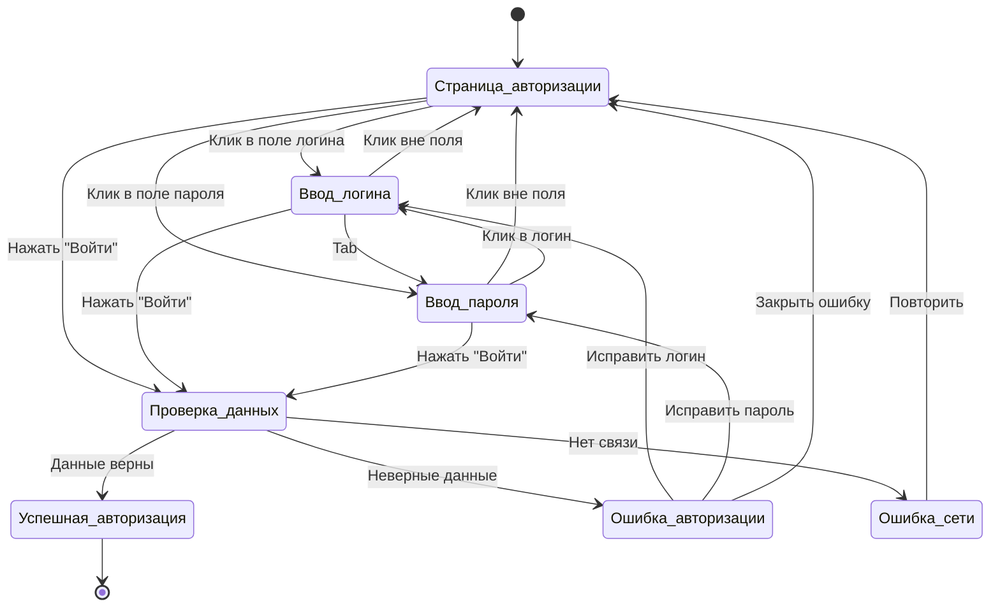

# 1. Таблица переходов и состояний для страницы авторизации
| Текущее состояние |	Событие/Действие |	Следующее состояние |	Описание |
|------- | :-------:| :-------:|:-------:|
| Страница авторизации |	Клик в поле логина |	Ввод логина |	Активация поля для ввода логина |
|Страница авторизации |	Клик в поле пароля |	Ввод пароля |	Активация поля для ввода пароля |
|Страница авторизации |	Нажатие кнопки "Войти" |	Проверка данных |	Отправка данных на сервер |
|Ввод логина |	Клик вне поля ввода |	Страница авторизации |	Деактивация поля ввода |
|Ввод логина | 	Нажатие Tab / Клик в поле пароля  |	Ввод пароля |	Переход к вводу пароля |
|Ввод логина |	Нажатие кнопки "Войти" |	Проверка данных |	Отправка данных на сервер |
|Ввод пароля |	Клик вне поля ввода |	Страница авторизации |	Деактивация поля ввода |
|Ввод пароля  |	Клик в поле логина |	Ввод логина |	Возврат к редактированию логина |
|Ввод пароля |	Нажатие кнопки "Войти" |	Проверка данных |	Отправка данных на сервер |
|Проверка данных |	Данные корректны |	Успешная авторизация |	Авторизация прошла успешно |
|Проверка данных |	Неверный логин/пароль |	Ошибка авторизации |	Отображение сообщения об ошибке |
|Проверка данных |	Нет соединения |	Ошибка сети |	Проблемы с сетевым подключением |
|Успешная авторизация |	Переход завершен |	[*] |	Перенаправление в личный кабинет |
|Ошибка авторизации |	Исправить логин |	Ввод логина |	Редактирование поля логина |
|Ошибка авторизации |	Исправить пароль |	Ввод пароля |	Редактирование поля пароля |
|Ошибка авторизации |	Закрыть сообщение об ошибке |	Страница авторизации |	Возврат к форме авторизации |
|Ошибка сети|	Повторить попытку |	Страница авторизации |	Повторная отправка данных |
---

# Диаграмма состояний для страницы авторизации

