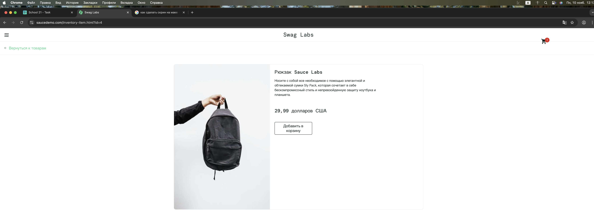

#  Составить баг-репорт

## Расхождение в отображении цены товара между карточкой в каталоге и страницей товара

## критичность: средняя

## серьёзность: Major

## шаги воспроизведения

Детали бага

Шаги воспроизведения:

Авторизоваться на сайте https://www.saucedemo.com/

Перейти на страницу каталога товаров

Запомнить цену любого товара в каталоге (например, "Sauce Labs Backpack" показывает цену $88.96)

Кликнуть на карточку товара для перехода на страницу товара

На странице товара проверить цену (правильно показывает $29.99)

Вернуться обратно в каталог (кнопка "Back to products")

Наблюдать за ценой товара в каталоге

Цены на товары опять изминились 
---
## ожидаемый результат

Цена товара должна оставаться одинаковой во всех местах отображения:

В карточке товара в каталоге

На странице детального просмотра товара

При возврате в каталог из страницы товара
---
## фактический результат

Цена товара меняется при навигации:

При первом входе в каталог: отображается одна цена  $88.96

На странице товара: отображается правильная цена ($29.99)

При возврате в каталог: цена может измениться на другую  $8.97
---
## Дополнительная информация:

Баг воспроизводится для нескольких товаров

В консоли браузера нет ошибок

Скриншоты с разными ценами: [прилагаются]

Баг не постоянный - иногда показывает правильную цену
---
# Почему это баг, а не фича:
- Нарушение консистентности данных: Цена товара - это объективный атрибут, который не должен меняться случайным образом

- Введение в заблуждение: Пользователь видит разные цены за один и тот же товар

- Влияние на принятие решений: Разная цена может повлиять на решение о покупке

- Нарушение принципов e-commerce: В интернет-торговле цена должна быть четкой и однозначной

## Ожидаемое поведение:
- Единая система управления ценами

- Консистентное отображение данных во всех компонентах

- Стабильность цен в рамках одной сессии

- Четкое соответствие цены конкретному товару
---
# Гипотеза о возможных причинах возникновения дефекта и точках исправления

## Возможные причины:

- Разные источники данных: Самая вероятная причина. Цена в каталоге может браться из одного массива данных (например, краткая информация о товаре для превью), а цена на странице товара — из другого, более детального массива. Эти два массива по какой-то причине не синхронизированы.

- Ошибка в коде (Hardcoded value): Цена на одной из страниц могла быть "захардкожена" (прописана напрямую в HTML или коде) на этапе разработки или тестирования и забыта, в то время как другая страница берет актуальную цену из базы данных.

## Точки исправления (Техническое размышление):

- Backend: Проверить API, который возвращает данные для карточки товара в каталоге, и API, который возвращает полные данные для страницы товара. Убедиться, что оба эндпоинта берут цену из одного и того же поля в базе данных.

- Frontend: Проверить, нет ли в компоненте карточки товара или на странице товара статически прописанной цены, которая переопределяет значение, пришедшее с бэкенда.

- База данных: Убедиться, что в базе данных для каждого товара существует только одно поле price, а не несколько (например, price_catalog, price_detail).
---
# Какое влияние дефекта на пользователя и бизнес-процесс
## Риски и неудобства для пользователя:

- Потеря доверия: Это главный риск. Пользователь видит, что сайт показывает разные цены. Это заставляет его усомниться в честности магазина и в том, не обманут ли его на этапе оплаты.

- Путаница и когнитивная нагрузка: Пользователь тратит умственные усилия на то, чтобы понять, какая же цена является правильной. Это создает негативный пользовательский опыт (UX).

- Сомнения в покупке: Увидев расхождение, пользователь может отказаться от покупки, опасаясь, что с него спишут неправильную, большую сумму.

- Увеличение нагрузки на службу поддержки: Пользователи могут начать массово писать или звонить в поддержку с вопросом "Почему цены разные?", что приведет к увеличению затрат компании.

## Риски для бизнеса:

- Прямая потеря продаж: Как следствие из пункта 3 для пользователя — снижение конверсии и потеря revenue.

- Удар по репутации бренда: Магазин, который не может корректно отобразить цену, выглядит ненадежным и непрофессиональным. В эпоху соцсетей и отзывов это может нанести значительный ущерб.

- Юридические риски (в некоторых юрисдикциях): В ряде стран законодательство о защите прав потребителей требует, чтобы рекламируемая цена соответствовала цене на кассе. Хотя здесь речь о странице товара, а не о чеке, подобная несогласованность может привлечь внимание контролирующих органов.

- Некорректная аналитика: Если в систему аналитики передаются разные цены, это может исказить данные о средней стоимости заказа, эффективности маркетинговых кампаний и других ключевых бизнес-метриках.