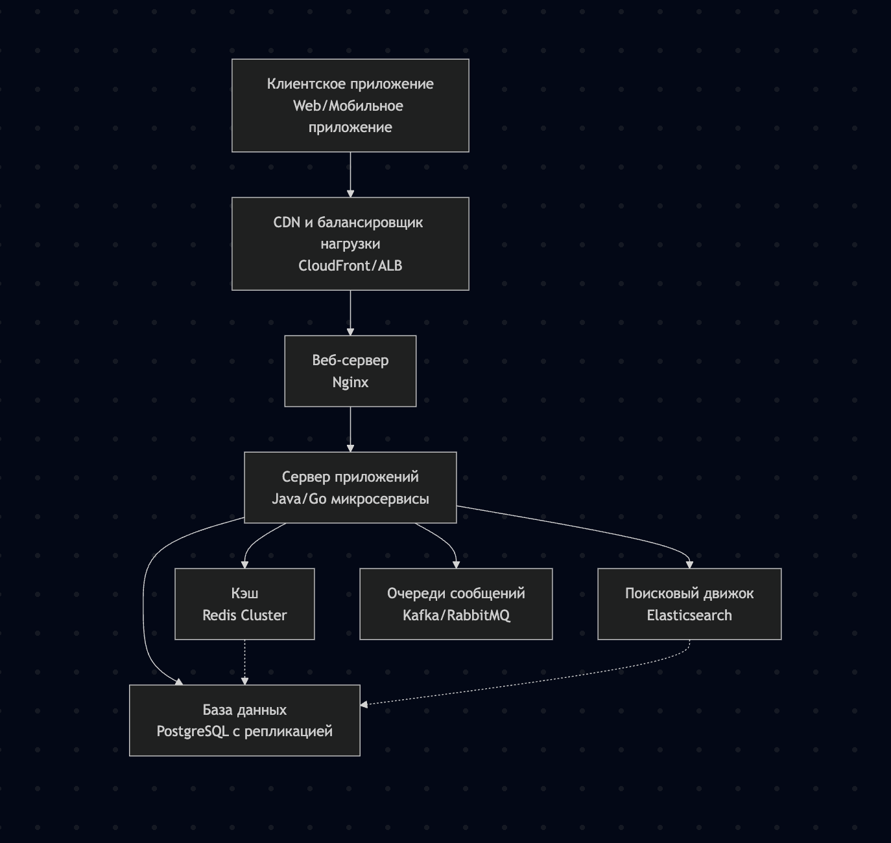

# Таблица: Основные уровни Трехзвенной архитектуры

| Уровень | Основная функция | Ключевые компоненты и технологии | Примеры и примечания |
| :---: | :---: | :---: | :---: |
| **Клиентский уровень (Presentation Layer)** | Взаимодействие с пользователем, отображение данных и получение пользовательского ввода. | - Пользовательский интерфейс (UI) - Веб-браузеры - Фронтенд-фреймворки (React, Angular, Vue.js) - Мобильные SDK (Swift, Kotlin) - Десктопные фреймворки (Electron, WPF) | - **Веб-браузер:** Отображает HTML, CSS, JavaScript. - **Мобильное приложение:** Нативное приложение для iOS или Android. - **Десктопная программа:** Приложение для Windows, macOS. |
| **Сервер приложений (Application Layer)** | Обработка бизнес-логики, правил приложения и координация между клиентским уровнем и уровнем данных. | - Веб-серверы (Nginx, Apache) - Серверы приложений (Node.js, Tomcat) - API (REST, GraphQL) - Микросервисы - Бэкенд-фреймворки (Spring, Django, Express.js) | - **Интернет-магазин:** Обработка заказов, управление корзиной, интеграция с платёжными системами. - Отвечает за безопасность, аутентификацию и целостность данных. |
| **Сервер данных (Data Layer)** | Надёжное хранение, управление и предоставление доступа к данным. | - Системы управления базами данных (СУБД): MySQL, PostgreSQL, MongoDB - Файловые хранилища - Кэширующие серверы (Redis) - Data Warehouses | - **Реляционная БД (MySQL):** Для структурированных данных с четкими схемами. - **NoSQL БД (MongoDB):** Для неструктурированных или полуструктурированных данных. - Ключевую роль играет в производительности и масштабируемости. |

---

# Таблица: Многоуровневой архитектуры

| Доп. уровни | Назначение | Компоненты | Функции |
| :------: | :------: | :------: | :------: |
| **Уровень интеграции (Integration Tier)** | Взаимодействие с внешними системами | - API Gateway - ESB (Enterprise Service Bus) - Микросервисы интеграции | - Оркестрация сервисов - Преобразование данных - Маршрутизация запросов - Агрегация данных из разных источников |
| **Уровень кэширования (Caching Tier)** | Повышение производительности | - Redis Cluster - Memcached  - CDN (Content Delivery Network) | - Кэширование часто запрашиваемых данных - Снижение нагрузки на БД - Ускорение отклика приложения |
| **Уровень очередей (Message Queue Tier)** | Асинхронная обработка задач | - RabbitMQ - Apache Kafka - AWS SQS | - Буферизация запросов - Обеспечение надежной доставки сообщений - Обработка фоновых задач |

---

Другие веб-приложения с похожей архитектурой:  
- Wildberries  
- AliExpress  
- Amazon
- Yandex Market

## Анализ компонентов и тестирование

| Структура компонента | 1-2 наиболее вероятных типа сбоя | Как проявляется для пользователя | Тип нефункционального тестирования |
|---------------------|----------------------------------|----------------------------------|-----------------------------------|
| **Сервер приложений (микросервисы)** | 1. Утечка памяти в Java-микросервисе 2. Сетевой разрыв между микросервисами | 1. Медленная загрузка страниц товаров 2. Ошибка "Невозможно добавить в корзину" | Стресс-тестирование Тестирование отказоустойчивости |
| **База данных PostgreSQL** | 1. Перегрузка запросами в час распродаж 2. Сбой репликации | 1. Ошибка при оформлении заказа 2. Расхождение данных в заказах | Нагрузочное тестирование Тестирование восстановления БД |
| **Поисковый движок Elasticsearch** | 1. Переполнение индексов 2. Сетевые задержки в кластере | 1. Поиск не находит товары 2. Медленные результаты поиска | Производительности тестирование Тестирование масштабируемости |
| **Кэш Redis Cluster** | 1. Падение узла кластера 2. Истечение TTL кэша | 1. Медленная загрузка каталога 2. Показ устаревших цен | Тестирование отказоустойчивости Тестирование согласованности |

## Сравнение: «Горячий» vs «Холодный» резерв

| Критерий                | Горячий резерв (Hot Standby)                                             | Холодный резерв (Cold Standby)                                           |
|-------------------------|--------------------------------------------------------------------------|--------------------------------------------------------------------------|
| **Надёжность**          | Очень высокая — готов к мгновенному переключению                        | Низкая — требует времени на запуск и восстановление                     |
| **Синхронизация данных**| В реальном времени (например, PostgreSQL streaming replication + Patroni)| По расписанию: бэкапы раз в 1–24 часа (WAL-G, pgBackRest)              |
| **Время переключения**  | 1–15 сек (Patroni автоматически выбирает нового мастера)                | от 5 минут до нескольких часов (зависит от объёма данных и команды)     |
| **Стоимость**           | Высокая — 2× железо + сетевой трафик репликации + лицензии               | Низкая — ресурсы простаивают, хранение бэкапов дёшево                   |
| **Плюсы**               | - RTO/RPO ≈ 0 - Подходит для критичных сервисов (платежи, заказы) - Полная автоматизация | - Подходит для аналитики, логов, архивов - Прост в эксплуатации     |
| **Минусы**              | - Сложность настройки и мониторинга - Риск split-brain при сетевых сбоях | - Потеря данных за период между бэкапами - Не подходит для OLTP     |

Конечно! Вот **краткий сценарий проверки отказоустойчивости** для компонента **PostgreSQL-кластер (order-service)** при использовании **«горячего» резерва**:

---

###  Краткий сценарий тестирования

Компонент: PostgreSQL (управление через Patroni).  
Цель: Проверить автоматический failover без потери данных.

####  Шаги:
1. Запустить нагрузку: 100 RPS (30% — создание заказов).  
2. Принудительно остановить мастер-ноду (`systemctl stop patroni`).  
3. Дождаться автоматического переключения (ожидаем: ≤10 сек).  
4. Продолжить нагрузку 1 минуту.  
5. Сверить: все заказы сохранены, ошибок < 0.5%.

#### Контролируемые метрики:
| Метрика | Цель |
|:--------:|:------:|
| **RTO** | ≤ 10 с |
| **RPO** | = 0 (ни одного потерянного заказа) |
| **% HTTP 5xx** | ≤ 0.5% |
| **WAL lag до отказа** | ≤ 100 мс |
---